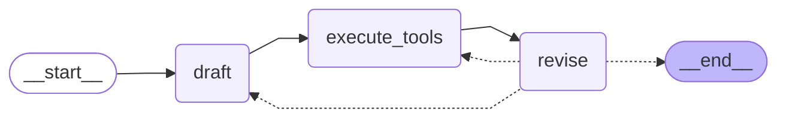

# Reflexion Agent with LangGraph 🦜🕸️

Implementation of a sophisticated Reflexion agent using LangGraph and LangChain, designed to generate high-quality responses through self-reflection and iterative improvement.

This project demonstrates advanced AI agent capabilities using LangGraph's state-of-the-art control flow mechanisms for self-reflection and response refinement.


[](https://www.udemy.com/course/langgraph/?couponCode=APRIL-2025)

## Features

- **Self-Reflection**: Implements sophisticated reflection mechanisms for response improvement
- **Iterative Refinement**: Uses a graph-based approach to iteratively enhance responses
- **Production-Ready**: Built with scalability and real-world applications in mind
- **Integrated Search**: Leverages Tavily search for enhanced response accuracy
- **Structured Output**: Uses Pydantic models for reliable data handling

## Architecture

The agent uses a graph-based architecture with the following components:

- **Entry Point**: `draft` node for initial response generation
- **Processing Nodes**: `execute_tools` and `revise` for refinement
- **Maximum Iterations**: 2 (configurable)
- **Chain Components**: First responder and revisor using GPT-4
- **Tool Integration**: Tavily Search for web research

## Environment Variables

To run this project, you will need to add the following environment variables to your .env file:

```bash
OPENAI_API_KEY=your_openai_api_key_here
TAVILY_API_KEY=your_tavily_api_key_here
LANGCHAIN_API_KEY=your_langchain_api_key_here  # Optional, for tracing
LANGCHAIN_TRACING_V2=true                      # Optional
LANGCHAIN_PROJECT=reflexion agent               # Optional
```

> **Important Note**: If you enable tracing by setting `LANGCHAIN_TRACING_V2=true`, you must have a valid LangSmith API key set in `LANGCHAIN_API_KEY`. Without a valid API key, the application will throw an error. If you don't need tracing, simply remove or comment out these environment variables.

## Run Locally

Clone the project:

```bash
git clone <repository-url>
cd reflexion-agent
```

Install dependencies:

```bash
poetry install
```

Start the agent:

```bash
poetry run python main.py
```

## Development Setup

1. Get your API keys:
   - [OpenAI Platform](https://platform.openai.com/) for GPT-4 access
   - [Tavily](https://tavily.com/) for search functionality
   - [LangSmith](https://smith.langchain.com/) (optional) for tracing

2. Copy the example environment file:
   ```bash
   cp .env.example .env
   ```

3. Edit `.env` with your API keys

## Running Tests

To run tests, use the following command:

```bash
poetry run pytest . -s -v
```

## Acknowledgements

This project builds upon:
- [LangGraph](https://langchain-ai.github.io/langgraph/tutorials/reflexion/reflexion/) for agent control flow
- [LangChain](https://github.com/langchain-ai/langchain) for LLM interactions
- [Tavily API](https://tavily.com/) for web search capabilities

## Development Timeline

This project follows the structure of the "LangGraph Course" lectures, demonstrating key concepts in building a Reflexion Agent:

1. **[Add initial project structure](https://github.com/emarco177/langgaph-course/commit/338cb56)** - Corresponds to **Lecture 22: Project Setup**
   * Set up the foundation with project configuration files (.gitignore, main.py, pyproject.toml, poetry.lock)
   
2. **[Create chains for AI-powered research functionality](https://github.com/emarco177/langgaph-course/commit/e6dd3fc)** - Corresponds to **Lecture 23: Actor Agent**
   * Implemented the first component of our agent architecture - the Actor
   * Added chains.py with prompt templates for generating detailed answers
   * Created schemas.py with Pydantic models for structured data handling
   
3. **[Enhance chains for answer revision capabilities](https://github.com/emarco177/langgaph-course/commit/8c0b27b)** - Corresponds to **Lecture 24: Revisor Agent**
   * Implemented the second component - the Revisor for self-reflection
   * Added ReviseAnswer class to schemas.py for improved response structure
   * Updated chain prompts to incorporate critique and citation requirements
   
4. **[Add dependencies and tools for graph nodes](https://github.com/emarco177/langgaph-course/commit/a092b97)** - Preparation for Graph Implementation
   * Integrated search functionality to enhance response accuracy
   * Added required dependencies for the complete graph workflow
   
5. **[Implement the complete message graph](https://github.com/emarco177/langgaph-course/commit/bb79ec6)** - Corresponds to **Lecture 28: Building our LangGraph Graph**
   * Connected Actor and Revisor agents in a complete LangGraph workflow
   * Defined graph nodes for drafting, tool execution, and revision
   * Established state management and conditional edge routing for reflection
   
6. **[Added readme](https://github.com/emarco177/langgaph-course/commit/112b808)** - Documentation of the final project
   * Overview of what was built in **Lecture 21: What are we building?**
   * Detailed explanation of the agent architecture and implementation

This progression demonstrates the complete development cycle of a Reflexion Agent using LangGraph, following the course structure from setup to implementation of chains, agents, and finally constructing the complete graph.

## 🔗 Links
[](https://www.udemy.com/course/langgraph/?referralCode=FEA50E8CBA24ECD48212)
[](https://www.linkedin.com/in/eden-marco/)
[](https://twitter.com/EdenEmarco177)