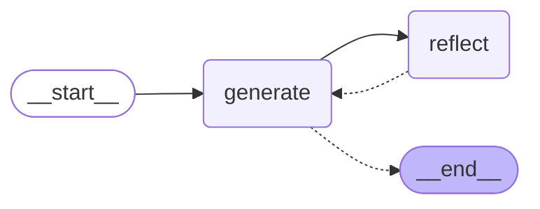

# 🦜🪞 LangGraph Reflection Agent

This repository contains a reflection-style agent architecture built with LangGraph that improves output quality through self-critique and refinement.

## ✨ Overview

The reflection agent uses a feedback loop between a generation component and a reflection component to iteratively improve responses to user queries. In this implementation, we've created a Twitter assistant that enhances tweets through multiple rounds of critique and revision.


[](https://www.udemy.com/course/langgraph/?couponCode=APRIL-2025)

## 🔄 How It Works

1. **Generate**: The initial component creates a response (in our case, a tweet) based on the user's input
2. **Reflect**: The reflection component evaluates the generated content and provides specific feedback for improvement
3. **Loop**: The generation component refines its output based on the reflection's feedback
4. **Termination**: The process ends after a predetermined number of iterations (currently set to 6)

This approach creates a self-improving system that produces higher quality outputs through deliberate reflection.

## 💻 Installation

```bash
# Clone the repository
git clone https://github.com/emarco177/langgraph-course.git
cd langgraph-course
git checkout project/reflection-agent

# Install dependencies using Poetry
poetry install
```

## 📁 Project Structure

```
reflection-agent/
├── chains.py         # Defines the prompt chains for generation and reflection
├── main.py           # Implements the core LangGraph structure
├── pyproject.toml    # Project dependencies and configuration
└── README.md         # This documentation
```

## 🛠️ Implementation Details

### Main Components

The reflection agent is built with two primary nodes:

1. **Generation Node** (in `chains.py`):
   - Uses a specialized prompt for creating Twitter content
   - Responds to critique by refining previously generated content

2. **Reflection Node** (in `chains.py`):
   - Critiques the generated content against quality criteria
   - Provides specific recommendations for improvement

## 🔍 Example Usage

```python
from langchain_core.messages import HumanMessage
from main import graph

# Create input prompt
input_tweet = HumanMessage(content="""Make this tweet better:
@LangChainAI — newly Tool Calling feature is seriously underrated.
After a long wait, it's here- making the implementation of agents across different models with function calling - super easy.
Made a video covering their newest blog post""")

# Run the reflection agent
improved_tweet = graph.invoke(input_tweet)
print(improved_tweet)
```

## 📚 Video Lessons

This project is built incrementally across multiple video lessons. Each commit represents a specific lesson in the series:

| Lesson | Commit | Description |
|--------|--------|-------------|
| 1 | [adbee18](https://github.com/emarco177/langgaph-course/commit/adbee18) | **Getting Started**: Initial setup for the reflection agent |
| 2 | [aab1105](https://github.com/emarco177/langgaph-course/commit/aab1105) | **Project Structure**: Adding core files and dependencies with Poetry |
| 3 | [d2f15d2](https://github.com/emarco177/langgaph-course/commit/d2f15d2) | **Chain Implementation**: Building Twitter influencer prompts and generation logic |
| 4 | [ed491a6](https://github.com/emarco177/langgaph-course/commit/ed491a6) | **Graph Implementation**: Connecting nodes with conditional logic for feedback loops |

Each lesson builds on the previous one, demonstrating how to incrementally build a reflection agent architecture using LangGraph.

## 👏 Acknowledgment

This reflection agent implementation is based on the concepts and patterns described in the LangGraph documentation. For more information about reflection agents, visit the [LangGraph Reflection Tutorial](https://langchain-ai.github.io/langgraph/tutorials/reflection/reflection/).

## 🔗 Links
[](https://www.udemy.com/course/langgraph/?referralCode=FEA50E8CBA24ECD48212)
[](https://www.linkedin.com/in/eden-marco/)
[](https://twitter.com/EdenEmarco177)
