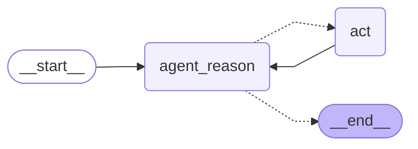

# ReAct Agent with LangGraph 🦜🕸️

A step-by-step tutorial repository for building a Reasoning and Acting (ReAct) agent using LangGraph and LangChain. Each commit in this repository represents a lesson in the implementation process.

This tutorial demonstrates how to build an advanced AI agent that can reason about its actions and execute tools in a controlled flow, following the ReAct pattern with LangGraph's sophisticated graph-based architecture.



[](https://www.udemy.com/course/langgraph/?couponCode=APRIL-2025)

## What You'll Learn

- **ReAct Pattern Implementation**: Build an agent that can reason about tasks and then act on that reasoning
- **Graph-Based Control Flow**: Use LangGraph to create sophisticated control flows for your AI agents
- **Tool Integration**: Learn how to equip your agent with tools that enable real-world interactions
- **State Management**: Implement proper state handling for complex agent behavior

## Tutorial Structure

This repository is organized as a series of commits, each representing a lesson in building the ReAct agent:

1. [**Project Setup**](https://github.com/emarco177/langgaph-course/commit/f9d7eac35b789cf86282e1a188d2889f2a66bc9b): Initial repository structure and environment configuration
   - Initialize project with main application file and Poetry configuration
   - Add dependencies for LangChain, LangGraph, and dotenv support

2. [**React Implementation**](https://github.com/emarco177/langgaph-course/commit/2415ad2710a112fd735020a2f99f073d0483b905): Building the core agent functionality
   - Create react.py for ReAct agent implementation 
   - Add tools and prompt integration

3. [**State Management**](https://github.com/emarco177/langgaph-course/commit/478dd4e52447c4140a97ce899172f1a6c26506f9): Creating state tracking for the agent
   - Add AgentState class to state.py
   - Implement state management for agent actions and outcomes

4. [**Agent Nodes**](https://github.com/emarco177/langgaph-course/commit/ef2a0779e97e585bb7bdd5ec43dae1b0a3fddd16): Setting up the graph nodes
   - Add nodes.py to implement agent reasoning
   - Create tool execution logic components

5. [**Graph Construction**](https://github.com/emarco177/langgaph-course/commit/b8b115d1ca36887eb1a332491d94a02438b70de6): Building the complete LangGraph workflow
   - Add graph generation functionality to main.py
   - Update model in react.py for full integration

## Environment Variables

To run this project, you will need to add the following environment variables to your .env file:

```bash
OPENAI_API_KEY=your_openai_api_key_here
TAVILY_API_KEY=your_tavily_api_key_here  # If using Tavily for search
LANGCHAIN_API_KEY=your_langchain_api_key_here  # Optional, for tracing
LANGCHAIN_TRACING_V2=true                      # Optional
LANGCHAIN_PROJECT=react agent                  # Optional
```

> **Important Note**: If you enable tracing by setting `LANGCHAIN_TRACING_V2=true`, you must have a valid LangSmith API key set in `LANGCHAIN_API_KEY`. Without a valid API key, the application will throw an error.

## Getting Started

Clone the repository:

```bash
git clone https://github.com/emarco177/langgaph-course.git
cd langgaph-course
```

Install dependencies:

```bash
pip install -r requirements.txt
# or if using Poetry:
poetry install
```

Follow along with each commit to learn the process of building a ReAct agent:

```bash
# View all commits in the tutorial
git log --oneline

# Check out specific lessons:
git checkout f9d7eac  # Lesson 1: Project Setup
git checkout 2415ad2  # Lesson 2: React Implementation
git checkout 478dd4e  # Lesson 3: State Management
git checkout ef2a077  # Lesson 4: Agent Nodes
git checkout b8b115d  # Lesson 5: Graph Construction
```

## Prerequisites

- Python 3.10+
- Basic understanding of LLMs and prompt engineering
- Familiarity with Python and async programming (optional but helpful)

## Acknowledgements

This project builds upon:
- [LangGraph](https://langchain-ai.github.io/langgraph/) for agent control flow
- [LangChain](https://github.com/langchain-ai/langchain) for LLM interactions
- [ReAct Pattern](https://arxiv.org/abs/2210.03629) for agent reasoning methodology

## 🔗 Links
[](https://www.udemy.com/course/langgraph/?referralCode=FEA50E8CBA24ECD48212)
[](https://www.linkedin.com/in/eden-marco/)
[](https://twitter.com/EdenEmarco177)
